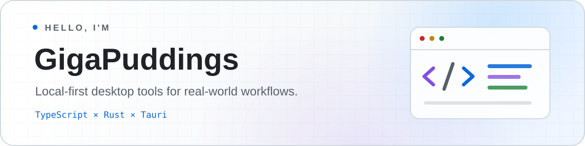

  <picture>
    <source media="(prefers-color-scheme: dark)" srcset="./assets/profile-banner.svg" />
    <source media="(prefers-color-scheme: light)" srcset="./assets/profile-banner-light.svg" />
    
  </picture>

  
  
  
  
  
  

  做离线可用、隐私友好、真正解决日常问题的桌面软件。

---

### Building now

#### [Snippets Code](https://github.com/GigaPuddings/snippets-code-t)

A local-first workspace for code snippets and knowledge assets—fast search, portable Markdown storage, and an extensible plugin ecosystem.

`Vue 3` · `Tauri 2` · `Rust` · `TypeScript` · `SQLite`

[Explore the project →](https://github.com/GigaPuddings/snippets-code-t)

---

  <code>Local-first</code>&nbsp;&nbsp; <code>Privacy by default</code>&nbsp;&nbsp; <code>Extensible tools</code>&nbsp;&nbsp; <code>Desktop engineering</code>

  “Make it big enough for everyone to have a piece.”

